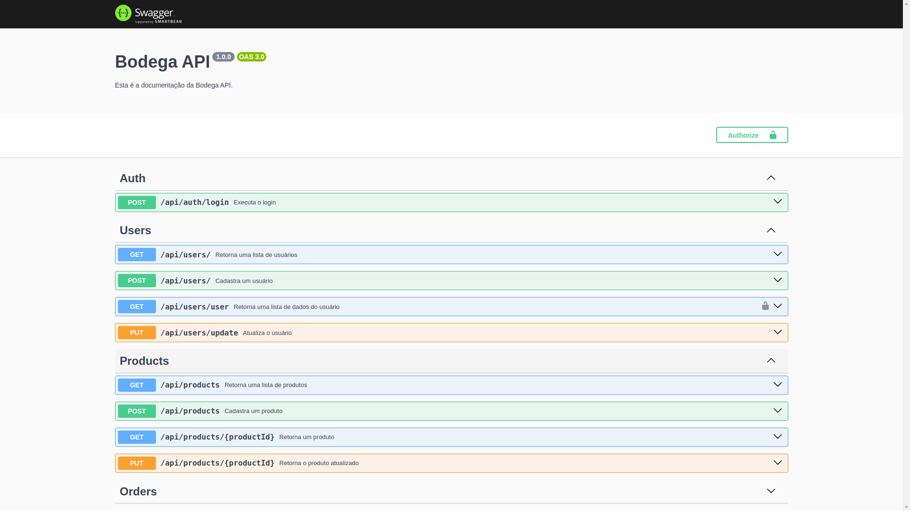

# Bodega API



## Sobre

A **Bodega API** é uma **API REST** que simula o Backend de um e-commerce, desenvolvido com **Node.js** e **Express**. Ela fornece recursos para autenticação de usuários, gerenciamento de produtos e pedidos, além da consulta ao histórico de compras.

A autenticação é feita via **JWT**, com senhas protegidas por **bcrypt**, e os dados são armazenados em um banco **MySQL**.

Esta API é consumida pelo Frontend do projeto **Bodega**, desenvolvido em **React**, disponível em: [Bodega](https://github.com/lucasrochabz/bodega).

A aplicação segue boas práticas de desenvolvimento, segurança e padronização de código.

## Funcionalidades

- Cadastro e login de usuários com autenticação segura
- Autenticação e autorização baseada em JWT
- Gerenciamento completo de usuários (criação, leitura, atualização e exclusão)
- Gerenciamento completo de produtos
- Gerenciamento completo de pedidos
- Consulta detalhada do histórico de pedidos de usuários autenticados
- Pagamentos simulados com atualização de status via requisições externas.

## Tecnologias

### Backend

- **Node.js** — Ambiente de execução JavaScript (Runtime).
- **Express** — Framework para construção de APIs REST.

### Banco de Dados

- **MySQL** — Banco de dados relacional.

### Autenticação e Segurança

- **JWT (JSON Web Token)** — Autenticação baseada em tokens.
- **Bcrypt** — Biblioteca para hash e criptografia de senhas.
- **Rate Limit (Express Rate Limit)** — Middleware para limitar requisições e prevenir ataques.

### Validação e Documentação

- **Joi** — Validação e sanitização de dados.
- **Swagger** — Documentação interativa da API.

### Infraestrutura e Qualidade

- **Docker** — Padronização e execução do ambiente.
- **Vitest** — Testes automatizados.

## Arquitetura e Decisões Técnicas

A API foi estruturada seguindo separação de responsabilidades:

- **Controllers**: Camada HTTP
- **Services**: Regras de negócio
- **Models**: Entidades de domínio
- **Repositories**: Acesso a dados
- **Schemas**: Validação de entrada
- **Helpers**: Padronização de respostas e execução de queries

Essa separação facilita testes, manutenção e evolução da aplicação.

## Fluxo de uma Requisição

1. A requisição chega pela rota.
2. Middlewares executam validações e autenticação.
3. O Controller recebe os dados já validados.
4. O Service aplica as regras de negócio.
5. O Repository acessa o banco de dados.
6. O Controller retorna a resposta padronizada.

## Padronização de Respostas

A API utiliza um padrão consistente de respostas HTTP:

- **200**: Requisição realizada com sucesso.
- **201**: Recurso criado com sucesso.
- **202**: Requisição aceita para processamento assíncrono.
- **400**: Erro de validação ou violação de regra de negócio.
- **401**: Não autenticado (token ausente ou inválido).
- **403**: Autenticado, porém sem permissão para acessar o recurso.
- **404**: Recurso não encontrado.
- **429**: Muitas requisições em um curto período (rate limit excedido).
- **500**: Erro interno inesperado no servidor.

## Testes

Os testes automatizados cobrem:

- Controllers (fluxo HTTP e respostas)
- Services (regras de negócio)
- Helpers críticos

Os testes foram pensados para validar comportamento, não implementação.

Framework utilizado: **Vitest**.

## Requisitos

- **Node.js** >= 16.0
- **NPM** >= 10.9
- **MySQL** >= 8.0

## Rodando localmente

1. Clone do projeto.
2. Acesse a pasta do projeto.
3. Copie o arquivo de variáveis de ambiente `.env.example`:
   ```bash
   cp .env.example .env
   ```
4. Configure o arquivo `.env` conforme seu ambiente.
5. Instale as dependências:
   ```bash
   npm install
   ```
6. Crie o banco de dados:
   ```bash
   npm run db:init
   ```
7. Crie as tabelas:
   ```bash
   npm run db:tables
   ```
8. Insira os dados iniciais:
   ```bash
   npm run db:seed
   ```
9. Inicie o servidor:
   ```bash
   npm run dev
   ```

## Ambiente com Docker

O uso do Docker garante:

- Ambiente padronizado entre desenvolvimento e produção
- Isolamento de dependências
- Facilidade de setup para novos desenvolvedores

## Rodando com Docker

### Pré-requisitos

- Docker.
- Docker Compose.

### Passos:

1. Clone o projeto e acesse a pasta.
2. Instale as dependências:
   ```bash
   npm install
   ```
3. Construa a imagem Docker:
   ```bash
   npm run docker:build
   ```
4. Inicie os containers em modo detached:
   ```bash
   npm run docker:up
   ```
5. A API estará disponível em: http://localhost:4000
6. Para acessar o terminal do container da API:
   ```bash
   docker exec -it bodega-api-api-1 bash
   ```
7. Dentro do container, crie as tabelas do banco de dados:
   ```bash
   npm run db:create-tables
   ```
8. Insira os dados iniciais nas tabelas:
   ```bash
   npm run db:insert-data
   ```

## Estrutura do projeto (visão geral)

```bash
bodega-api/
├── scripts/
│   ├── git/
│   ├── createDB.js
│   ├── createTables.js
│   └── insertData.js
│
├── sql/
│   ├── create_db/
│   │   └── 1_create_db.sql
│   │
│   ├── create_tables/
│   │   ├── 1_users_table.sql
│   │   ├── 2_addresses_table.sql
│   │   ├── 3_products_table.sql
│   │   ├── 4_orders_table.sql
│   │   ├── 5_orders_products_table.sql
│   │   └── 6_payments_table.sql
│   │
│   └── insert_data/
│       ├── 1_users_data.sql
│       ├── 2_addresses_data.sql
│       ├── 3_products_data.sql
│       ├── 4_orders_data.sql
│       └── 5_orders_products_data.sql
│
├── src/
│   ├── config/
│   │   ├── app.js
│   │   ├── auth.js
│   │   ├── database.js
│   │   └── env.js
│   │
│   ├── controllers/
│   │   ├── authController.js
│   │   ├── authController.test.js
│   │   └── ...
│   │
│   ├── database/
│   │   ├── connection.js
│   │   └── executeQuery.js
│   │
│   ├── dtos/
│   ├── entities/
│   │   ├── addressEntity.js
│   │   ├── orderEntity.js
│   │   ├── productEntity.js
│   │   └── userEntity.js
│   │
│   ├── errors/
│   ├── helpers/
│   │   ├── handleError.js
│   │   └── handleResponse.js
│   │
│   ├── mappers/
│   ├── middlewares/
│   ├── repositories/
│   ├── routes/
│   │   ├── api/
│   │   └── webhooks/
│   │
│   ├── schemas/
│   │   ├── auth/
│   │   ├── orders/
│   │   ├── products/
│   │   ├── shared/
│   │   └── users/
│   │
│   ├── services/
│   │   ├── authService.js
│   │   ├── authService.test.js
│   │   └── ...
│   │
│   ├── swagger/
│   ├── utils/
│   │   ├── hashUtils.js
│   │   └── tokenUtils.js
│   │
│   ├── app.js
│   └── server.js
│
├── .dockerignore
├── env.example
├── .gitignore
├── docker-compose.yml
├── Dockerfile
├── package-lock.json
├── package.json
└── README.md
```

## Estratégia de Branches

Este projeto utiliza o **Git Flow**.

- A branch `main` contém apenas código pronto para produção
- A branch `develop` é usada para integração das funcionalidades
- As branches `feature/*` são criadas a partir da `develop`
- As branches `release/*` são usadas para preparar novas versões
- As branches `hotfix/*` são usadas para correções urgentes
- As versões são marcadas com tags na branch `main`

## Frontend do Projeto

O Frontend que consome esta API está disponível no repositório: [Acesse o repositório do Frontend](https://github.com/lucasrochabz/bodega)

## Encontrou algum problema?

Caso encontre algum problema ou tenha sugestões de melhoria, abra uma [issue](https://github.com/lucasrochabz/bodega-api/issues).
