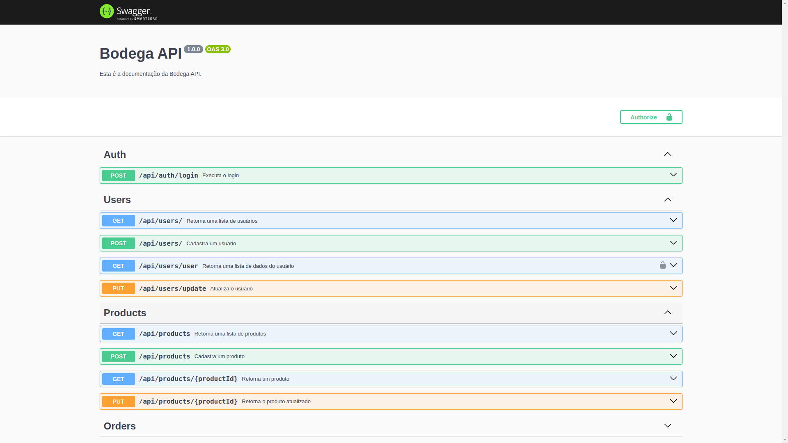

# Bodega API




## Sobre

A **Bodega API** é uma **API REST** que fornece a infraestrutura Backend de um e-commerce, desenvolvido com **Node.js** e **Express**. Ela fornece recursos para autenticação de usuários, gerenciamento de produtos e pedidos, além da consulta ao histórico de compras.

A autenticação é feita via **JWT**, com senhas protegidas por **bcrypt**, e os dados são armazenados em um banco **MySQL**.

Esta API é consumida pelo Frontend do projeto **Bodega**, desenvolvido em **React**, disponível em: [Bodega](https://github.com/lucasrochabz/bodega).

A aplicação segue boas práticas de desenvolvimento, segurança e padronização de código.

| Característica         | Descrição   |
| ---------------------- | ----------- |
| Tipo de aplicação      | API RESTful |
| Estilo arquitetural    | Monolítico  |
| Arquitetura interna    | Em camadas  |
| Estado da aplicação    | Stateless   |
| Infraestrutura         | Docker      |
| Plataforma de execução | Railway     |

## Funcionalidades

- [x] Cadastro e login de usuários com autenticação segura
- [x] Autenticação e autorização baseada em JWT
- [x] Gerenciamento completo de usuários (criação, leitura, atualização e exclusão)
- [x] Gerenciamento completo de produtos
- [x] Gerenciamento completo de pedidos
- [x] Consulta detalhada do histórico de pedidos de usuários autenticados
- [x] Pagamentos simulados com atualização de status via requisições externas.

## Tecnologias

| Categoria      | Tecnologia         | Descrição                              |
| -------------- | ------------------ | -------------------------------------- |
| Backend        | Node.js            | Runtime JavaScript                     |
| Backend        | Express            | Framework para APIs REST               |
| Banco de Dados | MySQL              | Banco de dados relacional              |
| Autenticação   | JWT                | Autenticação baseada em tokens         |
| Segurança      | bcrypt             | Hash seguro de senhas                  |
| Segurança      | Express Rate Limit | Limitar requisições e prevenir ataques |
| Validação      | Joi                | Validação e sanitização de dados       |
| Documentação   | Swagger            | Documentação interativa da API         |
| Infraestrutura | Docker             | Padronização e execução do ambiente    |
| Testes         | Vitest             | Testes automatizados                   |

## Arquitetura e Decisões Técnicas

A API foi estruturada seguindo separação de responsabilidades:

- **Controllers**: Camada HTTP
- **Services**: Regras de negócio
- **Models**: Entidades de domínio
- **Repositories**: Acesso a dados
- **Schemas**: Validação de entrada
- **Helpers**: Padronização de respostas e execução de queries

Essa separação facilita testes, manutenção e evolução da aplicação.

## Fluxo de uma Requisição

1. A requisição chega pela rota.
2. Middlewares executam validações e autenticação.
3. O Controller recebe os dados já validados.
4. O Service aplica as regras de negócio.
5. O Repository acessa o banco de dados.
6. O Controller retorna a resposta padronizada.

## Padronização de Respostas

A API utiliza um padrão consistente de respostas HTTP:

| Status | Descrição                                                    |
| ------ | ------------------------------------------------------------ |
| 200    | Requisição realizada com sucesso                             |
| 201    | Recurso criado com sucesso                                   |
| 202    | Requisição aceita para processamento assíncrono              |
| 400    | Erro de validação ou violação de regra de negócio            |
| 401    | Não autenticado (token ausente ou inválido)                  |
| 403    | Autenticado, porém sem permissão para acessar o recurso      |
| 404    | Recurso não encontrado                                       |
| 429    | Muitas requisições em um curto período (rate limit excedido) |
| 500    | Erro interno inesperado no servidor                          |

## Testes

Os testes automatizados cobrem:

- Controllers (fluxo HTTP e respostas)
- Services (regras de negócio)
- Helpers críticos

Os testes foram pensados para validar comportamento, não implementação.

Framework utilizado: **Vitest**.

## Requisitos

- **Node.js** >= 18.0
- **NPM** >= 10.9
- **MySQL** >= 8.0
- **Docker**
- **Docker Compose**

## Rodando

### Localmente

1. Clone do projeto.
2. Acesse a pasta do projeto.
3. Copie o arquivo de variáveis de ambiente `.env.example`:
   ```bash
   cp .env.example .env
   ```
4. Configure o arquivo `.env` conforme seu ambiente.
5. Instale as dependências:
   ```bash
   npm install
   ```
6. Configure o banco de dados:
   ```bash
   npm run db:setup
   ```
7. Inicie o servidor:
   ```bash
   npm run dev
   ```

### Com Docker

1. Clone o projeto e acesse a pasta.
2. Copie o arquivo `.env.example`:
   ```bash
   cp .env.example .env
   ```
3. Construa a imagem Docker:
   ```bash
   npm run docker:build
   ```
4. Inicie os containers em modo detached:
   ```bash
   npm run docker:up
   ```
5. Para acessar o terminal do container da API:
   ```bash
   docker exec -it bodega-api-api-1 bash
   ```
6. Dentro do container, execute:
   Criar tabelas:
   ```bash
   npm run db:create-tables
   ```
   Insira os dados iniciais:
   ```bash
   npm run db:insert-data
   ```
7. A API estará disponível em: http://localhost:4000

## Estrutura do projeto (visão geral)

```bash
bodega-api/
├── .github/
│   └── workflows/
│
├── scripts/
│   ├── git/
│   ├── createDB.js
│   ├── createTables.js
│   └── insertData.js
│
├── sql/
│   ├── create_db/
│   │   └── 1_create_db.sql
│   │
│   ├── create_tables/
│   │   ├── 1_users_table.sql
│   │   ├── 2_addresses_table.sql
│   │   ├── 3_products_table.sql
│   │   ├── 4_orders_table.sql
│   │   ├── 5_orders_products_table.sql
│   │   └── 6_payments_table.sql
│   │
│   └── insert_data/
│       ├── 1_users_data.sql
│       ├── 2_addresses_data.sql
│       ├── 3_products_data.sql
│       ├── 4_orders_data.sql
│       └── 5_orders_products_data.sql
│
# fix: mover shared para dentro de src/
├── shared/
│   ├── errors/
│   ├── helpers/
│   │   ├── handleError.js
│   │   └── handleResponse.js
│   │
│   ├── middlewares/
│   └── utils/
│       ├── hash.utils.js
│       ├── slugify.utils.js
│       └── token.utils.js
│
├── src/
│   ├── config/
│   │   ├── env/
│   │   ├── app.js
│   │   ├── auth.js
│   │   ├── database.js
│   │   └── email.js
│   │
│   ├── controllers/
│   │   ├── auth.controller.js
│   │   ├── auth.controller.test.js
│   │   └── ...
│   │
│   ├── database/
│   │   ├── connection.js
│   │   └── executeQuery.js
│   │
│   ├── dtos/
│   ├── entities/
│   │   ├── address.entity.js
│   │   ├── order.entity.js
│   │   ├── product.entity.js
│   │   └── user.entity.js
│   │
│   ├── lib/
│   │   └── resend.js
│   │
│   ├── mappers/
│   ├── repositories/
│   ├── routes/
│   │   ├── api/
│   │   └── webhooks/
│   │
│   ├── schemas/
│   │   ├── auth/
│   │   ├── orders/
│   │   ├── products/
│   │   ├── shared/
│   │   └── users/
│   │
│   ├── services/
│   │   ├── auth.service.js
│   │   ├── auth.service.test.js
│   │   └── ...
│   │
│   ├── swagger/
│   └── app.js
│
├── env.example
├── .gitignore
│
├── .dockerignore
├── Dockerfile
├── docker-compose.yml
├── docker-compose.dev.yml
│
├── package-lock.json
├── package.json
├── server.js
└── README.md
```

## Estratégia de Branches

Este projeto utiliza o **Git Flow**.

- A branch `main` contém apenas código pronto para produção
- A branch `develop` é usada para integração das funcionalidades
- As branches `feature/*` são criadas a partir da `develop`
- As branches `release/*` são usadas para preparar novas versões
- As branches `hotfix/*` são usadas para correções urgentes
- As versões são marcadas com tags na branch `main`

## Frontend do Projeto

O Frontend que consome esta API está disponível no repositório: [Acesse o repositório do Frontend](https://github.com/lucasrochabz/bodega)

## Encontrou algum problema?

Caso encontre algum problema ou tenha sugestões de melhoria, abra uma [issue](https://github.com/lucasrochabz/bodega-api/issues).
