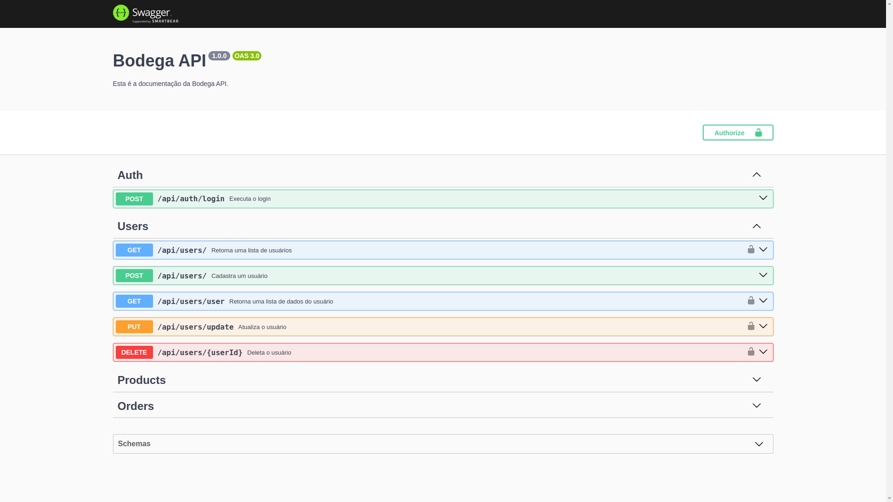

# Bodega API v1.6.1



## Sobre

A **Bodega API** é uma **API REST** que simula o Backend de um e-commerce, desenvolvido com **Node.js** e **Express**. Ela fornece recursos para autenticação de usuários, gerenciamento de produtos e pedidos, além da consulta ao histórico de compras.

A autenticação é feita via **JWT**, com senhas protegidas por **bcrypt**, e os dados são armazenados em um banco **MySQL**.

Esta API é consumida pelo Frontend do projeto **Bodega**, desenvolvido em **React**, disponível em: [Bodega](https://github.com/lucasrochabz/bodega).

A aplicação segue boas práticas de desenvolvimento, segurança e padronização de código.

## Funcionalidades

- Autenticação e autorização com JWT
- Cadastro e login de usuários
- Listagem de produtos
- Criação e consulta de pedidos
- Histórico de compras por usuário

## Tecnologias

### Backend

- **Node.js** — Ambiente de execução JavaScript (Runtime).
- **Express** — Framework para construção de APIs REST.

### Banco de Dados

- **MySQL** — Banco de dados relacional.

### Autenticação e Segurança

- **JWT (JSON Web Token)** — Autenticação baseada em tokens.
- **Bcrypt** — Biblioteca para hash e criptografia de senhas.
- **Rate Limit (Express Rate Limit)** — Middleware para limitar requisições e prevenir ataques.

### Validação e Documentação

- **Joi** — Validação e sanitização de dados.
- **Swagger** — Documentação interativa da API.

### Infraestrutura e Qualidade

- **Docker** — Padronização e execução do ambiente.
- **Vitest** — Testes automatizados.

## Requisitos

- **Node.js** na versão 16.0 ou superior
- **NPM** na versão 10.9 ou superior
- **MySQL** na versão 8.0 ou superior

## Rodando localmente

1. Clone do projeto.
2. Acesse a pasta do projeto.
3. Copie o arquivo de variáveis de ambiente `.env.example`:
   ```bash
   cp .env.example .env
   ```
4. Configure o arquivo `.env` conforme seu ambiente.
5. Instale as dependências:
   ```bash
   npm install
   ```
6. Crie o banco de dados:
   ```bash
   npm run db:init
   ```
7. Crie as tabelas:
   ```bash
   npm run db:tables
   ```
8. Insira os dados iniciais:
   ```bash
   npm run db:seed
   ```
9. Inicie o servidor:
   ```bash
   npm run dev
   ```

## Rodando com Docker

### Pré-requisitos

- Docker.
- Docker Compose.

### Passos:

1. Clone o projeto e acesse a pasta.
2. Instale as dependências:
   ```bash
   npm install
   ```
3. Construa a imagem Docker:
   ```bash
   npm run docker:build
   ```
4. Inicie os containers em modo detached:
   ```bash
   npm run docker:up
   ```
5. A API estará disponível em: http://localhost:4000
6. Para acessar o terminal do container da API:
   ```bash
   docker exec -it bodega-api-api-1 bash
   ```
7. Dentro do container, crie as tabelas do banco de dados:
   ```bash
   npm run db:create-tables
   ```
8. Insira os dados iniciais nas tabelas:
   ```bash
   npm run db:insert-data
   ```

## Estrutura do projeto

```bash
bodega-api/
├── scripts/
│   ├── git/
│   ├── createDB.js
│   ├── createTables.js
│   └── insertData.js
│
├── sql/
│   ├── create_db/
│   │   └── 1_create_db.sql
│   │
│   ├── create_tables/
│   │   ├── 1_users_table.sql
│   │   ├── 2_addresses_table.sql
│   │   ├── 3_products_table.sql
│   │   ├── 4_orders_table.sql
│   │   └── 5_orders_products_table.sql
│   │
│   └── insert_data/
│       ├── 1_users_data.sql
│       ├── 2_addresses_data.sql
│       ├── 3_products_data.sql
│       ├── 4_orders_data.sql
│       └── 5_orders_products_data.sql
│
├── src/
│   ├── config/
│   ├── controllers/
│   │   ├── controller.js
│   │   └── controller.test.js
│   │
│   ├── database/
│   ├── dtos/
│   ├── errors/
│   ├── helpers/
│   │   ├── executeQuery.js
│   │   └── handleServiceResponse.js
│   │
│   ├── middlewares/
│   ├── models/
│   │   ├── addressModel.js
│   │   ├── orderModel.js
│   │   ├── productModel.js
│   │   └── userModel.js
│   │
│   ├── repositories/
│   ├── routes/
│   ├── schemas/
│   │   ├── auth/
│   │   ├── orders/
│   │   ├── products/
│   │   ├── shared/
│   │   └── users/
│   │
│   ├── services/
│   │   ├── services.js
│   │   └── services.test.js
│   │
│   ├── swagger/
│   ├── utils/
│   │   ├── hashUtils.js
│   │   └── tokenUtils.js
│   │
│   ├── app.js
│   └── server.js
│
├── .dockerignore
├── env.example
├── .gitignore
├── docker-compose.yml
├── Dockerfile
├── package-lock.json
├── package.json
└── README.md
```

## Frontend do Projeto

O Front-end que consome esta API está disponível no repositório: [Acesse o repositório do Frontend](https://github.com/lucasrochabz/bodega)

## Encontrou algum problema?

Caso encontre algum problema ou tenha sugestões de melhoria, abra uma [issue](https://github.com/lucasrochabz/bodega-api/issues).
